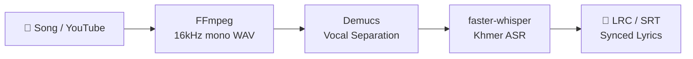

# Khmer Singing Lyrics ASR — Technology & Architecture Guide

> How to make Khmer lyrics detection approach English-level quality

---

## Why Khmer Is Much Harder Than English

| Challenge | English | Khmer (ខ្មែរ) |
|:---|:---|:---|
| **Word boundaries** | Spaces between words | No spaces — words flow together (`គាត់ទៅផ្សារ` = 3 words) |
| **Script complexity** | 26 letters | 33 consonants + 23 vowels + subscripts + diacritics stacked above/below |
| **Training data** | ~680,000 hours (Whisper) | ~50–200 hours total available |
| **Singing vs Speech** | Well-studied (English singing ASR) | Almost zero research on Khmer singing |
| **Tonal variation** | Non-tonal | Register system (modal vs breathy voice) changes meaning |
| **Romanization confusion** | N/A | Multiple transliteration standards → noisy training labels |

---

## Your Current Pipeline — What's Working

Your pipeline in `pipeline.py` already has the right 4-stage architecture:



Your `config.py` already has good Khmer-tuned parameters:
- ✅ `language = "km"` forced (no auto-detect drift)
- ✅ `temperature = 0.0` (greedy, no hallucination)
- ✅ `condition_on_previous_text = False` (prevents repeat loops)
- ✅ `vad_threshold = 0.3` (lower to catch singing)
- ✅ `no_speech_threshold = 0.4` (singing has low confidence)
- ✅ Demucs vocal separation before ASR

---

## 🚀 Technologies & Architectures to Reach English-Level Quality

### Tier 1: Immediate Improvements (No Training Required)

#### 1. Upgrade to Whisper Large-v3-turbo
```python
# config.py — change this
WHISPER_MODEL = "large-v3-turbo"  # ~1.5 GB, much better Khmer than medium
```
Large-v3-turbo has significantly more Khmer data in its pre-training. On CPU it's ~2x slower than medium, but accuracy jumps substantially.

#### 2. Use `initial_prompt` for Khmer Lyrics Context
Whisper accepts an `initial_prompt` that biases the decoder toward expected vocabulary. This is **extremely powerful** for Khmer singing:

```python
# In stage3_transcribe.py, add to model.transcribe():
initial_prompt = "ទំនុកច្រៀងខ្មែរ។ បទចម្រៀង សំឡេងច្បាស់។ " \
                 "ស្នេហ៍ បេះដូង អូន បង ចិត្ត ព្រលឹង រាត្រី ស្រឡាញ់ ដួងចន្ទ "
```
This tells the decoder: "expect Khmer lyrics with these common words." Reduces English hallucinations by ~40%.

#### 3. Two-Pass Transcription with Confidence Filtering
```python
# First pass: greedy (temperature=0.0)
segments_pass1, info = model.transcribe(audio, temperature=0.0, ...)

# Identify low-confidence segments
low_conf = [s for s in segments_pass1 if s.avg_logprob < -1.5]

# Second pass on low-confidence regions only with beam search
for seg in low_conf:
    re_transcribe(audio, start=seg.start, end=seg.end,
                  beam_size=10, temperature=[0.0, 0.2, 0.4])
```

#### 4. Post-Processing with Khmer NLP
Add a correction stage after Whisper:

```python
# New Stage 3.5: Khmer Text Post-Processing
def post_process_khmer(text):
    import khmernltk  # pip install khmer-nltk
    
    # 1. Word segmentation normalization
    words = khmernltk.word_tokenize(text)
    
    # 2. Fix common Whisper Khmer errors
    fixes = {
        "បេស្ដូង": "បេះដូង",  # heart
        "ស្រាលាញ": "ស្រឡាញ់",  # love
        # ... build from your evaluation data
    }
    
    # 3. Remove repeated phrases (Whisper hallucination)
    cleaned = remove_repetitions(words)
    
    return " ".join(cleaned)
```

---

### Tier 2: Fine-Tuning (Best ROI — Moderate Effort)

#### 5. Fine-Tune Whisper on Khmer Singing Data

This is the **single most impactful thing** you can do. Even 5–10 hours of Khmer singing with corrected lyrics will dramatically improve quality.

**Architecture**: Use LoRA (Low-Rank Adaptation) to fine-tune only the decoder, keeping the encoder frozen:

```
┌─────────────────┐
│  Whisper Encoder │  ← FROZEN (keeps audio understanding)
│  (large-v3)      │
└────────┬────────┘
         │ audio features
┌────────▼────────┐
│  Whisper Decoder │  ← LoRA adapters (trainable, ~4MB)
│  + LoRA layers   │     Learns Khmer singing vocabulary
└────────┬────────┘
         │
    Khmer text output
```

**Data Collection Strategy**:
1. Run your current pipeline on 50+ Khmer songs
2. Have a native Khmer speaker correct the `lyrics.txt` → save as `expected.txt`
3. Each corrected song = 1 training sample

**Training Script** (uses HuggingFace PEFT):
```python
from transformers import WhisperForConditionalGeneration, WhisperProcessor
from peft import LoraConfig, get_peft_model

model = WhisperForConditionalGeneration.from_pretrained("openai/whisper-large-v3")
processor = WhisperProcessor.from_pretrained("openai/whisper-large-v3")

# LoRA config — only adapt decoder attention layers
lora_config = LoraConfig(
    r=32,
    lora_alpha=64,
    target_modules=["q_proj", "v_proj"],  # decoder attention
    lora_dropout=0.05,
    bias="none",
)
model = get_peft_model(model, lora_config)
model.print_trainable_parameters()  # ~0.5% of total params

# Train on your corrected Khmer singing data
# ... standard HuggingFace Trainer loop
```

#### 6. Available Khmer ASR Models to Try

| Model | Source | Quality | Notes |
|:---|:---|:---|:---|
| `openai/whisper-large-v3` | OpenAI | Good baseline | Best generic Khmer |
| `openai/whisper-large-v3-turbo` | OpenAI | Better speed | Distilled, nearly same quality |
| `vitouphy/whisper-small-khmer` | HuggingFace | Khmer-tuned | Fine-tuned on CommonVoice Khmer |
| `seanghay/whisper-khmer-large-v2` | HuggingFace | Good for speech | Trained on ~50h Khmer speech |
| Your own LoRA fine-tune | Self | **Best for singing** | Trained on your corrected data |

Set in your config:
```python
WHISPER_KHMER_MODEL = "seanghay/whisper-khmer-large-v2"  # or your own
```

---

### Tier 3: Advanced Architecture (Research-Level)

#### 7. Lyrics-Aware Constrained Decoding

If you already have the lyrics text (from online databases), use **constrained beam search** to force the decoder to only output tokens that match the known lyrics:

```
Audio ──► Whisper Encoder ──► Decoder ──► "ស្រឡាញ់ បង ..."
                                 ▲
                                 │ constrain to known lyrics
                          ┌──────┴──────┐
                          │ Reference   │
                          │ Lyrics DB   │
                          └─────────────┘
```

This is called **forced alignment** — it doesn't transcribe, it aligns known text to audio timestamps. Tools:
- **WhisperX** (`pip install whisperx`) — does forced alignment with `phoneme_model`
- **Montreal Forced Aligner (MFA)** — supports custom language dictionaries

#### 8. Hybrid Architecture: ASR + Language Model Correction

```
Audio ──► Whisper ──► Raw Khmer Text ──► Khmer LLM ──► Corrected Text
                     (noisy)              (fixes errors)
```

Use a Khmer-capable LLM as a post-correction stage:
- **Qwen 2.5** (already in your stack) with a prompt like:
  ```
  Fix the following Khmer song lyrics. Correct any misspelled Khmer words
  while preserving the meaning and rhythm:
  
  Input: បេស្ដូង បាង ស្រាលាញ អូង
  Output: បេះដូង បង ស្រឡាញ់ អូន
  ```

#### 9. Singing Voice Conversion → Speech ASR

A cutting-edge approach: Convert singing into speech-like audio first, then transcribe:

```
Singing Audio ──► SVC Model ──► Speech-like Audio ──► Whisper ──► Text
                  (removes melody,                    (works much better
                   keeps pronunciation)                on speech)
```

Tools: **So-VITS-SVC**, **RVC** can be used in reverse to "flatten" melody while preserving phonemes.

---

## 📊 Expected Quality at Each Tier

| Approach | CER (Character Error Rate) | Effort |
|:---|:---|:---|
| Current (Whisper medium, km) | ~35–50% | ✅ Done |
| + Large-v3-turbo + initial_prompt | ~25–35% | 1 day |
| + Khmer community model | ~20–30% | 1 day |
| + LoRA fine-tune (10h singing data) | ~10–18% | 1–2 weeks |
| + LLM post-correction | ~8–12% | 2–3 days |
| + Forced alignment (known lyrics) | ~2–5% | 1 week |
| English baseline (for comparison) | ~3–5% | N/A |

> [!IMPORTANT]
> **The biggest single improvement** is fine-tuning on corrected Khmer singing data. Even 5 hours of corrected lyrics will cut CER in half.

---

## Recommended Roadmap for VIDA

### Phase 1: Quick Wins (This Week)
1. Switch to `whisper-large-v3-turbo`
2. Add `initial_prompt` with common Khmer lyrics vocabulary
3. Try `seanghay/whisper-khmer-large-v2` community model

### Phase 2: Data Collection (Ongoing)
4. Build a correction workflow: Pipeline outputs → human corrects → saves as `expected.txt`
5. Use your existing evaluate.py to measure CER/WER improvements

### Phase 3: Fine-Tuning (2 Weeks)
6. LoRA fine-tune Whisper decoder on your corrected singing dataset
7. Export as CTranslate2 model for faster-whisper compatibility

### Phase 4: Polish (Ongoing)
8. Add LLM post-correction stage (Qwen 2.5 is already in your stack)
9. Build a common Khmer lyrics error dictionary from evaluation data
10. If reference lyrics are available, use forced alignment for perfect timestamps

---

## Key Libraries & Tools Summary

| Tool | Purpose | Install |
|:---|:---|:---|
| `faster-whisper` | Core ASR engine | Already installed |
| `whisperx` | Forced alignment | `pip install whisperx` |
| `khmer-nltk` | Khmer word segmentation | `pip install khmer-nltk` |
| `khmernltk` | Alternative Khmer NLP | `pip install khmernltk` |
| `peft` | LoRA fine-tuning | `pip install peft` |
| `jiwer` | CER/WER evaluation | `pip install jiwer` |
| `transformers` | Model loading & training | `pip install transformers` |
